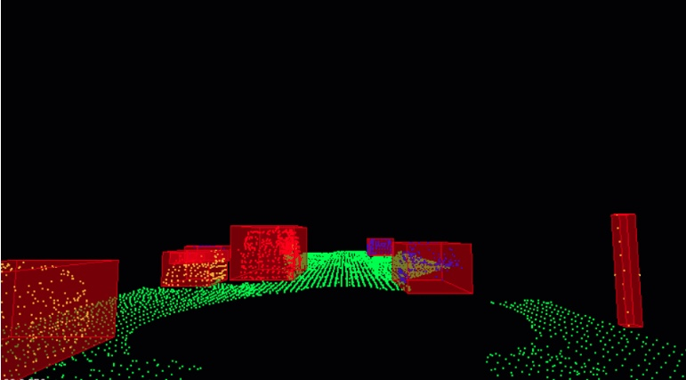

## Lidar Obstacle Detection
In this project lidar data is used to detect objects for automonus vehicle applications. The basic workflow of the project is:
* Down sample lidar point cloud for computational purposes
* Use Least Squares fitting in conjunction with RANSAC to fit a 2D plane to the road surface
* Filter out lidar points corrisponding to the road surface
* Initalize a KD-Tree to enhance clustering computations
* Cluster remaining lidar points into objects corrisponding to obstacles
* Fit a bounding box around each cluster

An example of the final obstacle detection is shown below:

## Installation

### Linux Ubuntu 16

Install PCL, C++

The link here is very helpful, 
https://larrylisky.com/2014/03/03/installing-pcl-on-ubuntu/

A few updates to the instructions above were needed.

* libvtk needed to be updated to libvtk6-dev instead of (libvtk5-dev). The linker was having trouble locating libvtk5-dev while building, but this might not be a problem for everyone.

* BUILD_visualization needed to be manually turned on, this link shows you how to do that,
http://www.pointclouds.org/documentation/tutorials/building_pcl.php

